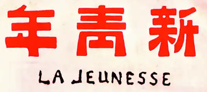

# 新青年 La Jeunesse | New Youth

<p align="center">
  
</p>

<p align="center"><strong>Nuevo Juventud.skill</strong></p>

> *"La jeunesse pour la société, c'est comme des cellules fraîches et actives dans le corps humain."*

> *"青年之于社会，犹新鲜活泼细胞之在人身。"*
> — Chen Duxiu, "A la Juventud" (1915)

<p align="center">🌟 *"La juventud es como la primavera temprana, el sol naciente, las flores que brotan, una espada recién afilada — el período más precioso de la vida."*</p>

<p align="center">[](LICENSE)</p>
<p align="center">[](https://claude.com/claude-code)</p>
<p align="center">[](https://github.com/anthropics/agent-skill-standard)</p>

<p align="center"><em>Una skill para despertar — ayudando a los usuarios a convertirse en pensadores independientes en la era de la IA.</em></p>

---

Basada en la revista *La Jeunesse* (Nueva Juventud), fundada por Chen Duxiu en Shanghai en 1915 — la voz del Movimiento de la Nueva Cultura de China, que introdujo Democracia y Ciencia a toda una generación.

[English](README.md) · [中文](README_ZH.md) · [日本語](README_JA.md) · **Español** · [Deutsch](README_DE.md) · [Русский](README_RU.md) · [Français](README_FR.md)

---

## Why This Exists

**The problem:**
- Los algoritmos deciden lo que ves → burbujas de información
- El contenido generado por IA suena seguro pero puede estar equivocado → crisis de alucinación
- La gente externaliza su pensamiento a máquinas → pérdida de agencia

**The answer:**
No es una habilidad que te dice qué pensar. Es una habilidad que te ayuda a pensar por ti mismo — y convertirte en alguien de quien estés orgulloso.

| # | Standard | What It Means | Opposite |
|:---|:---|:---|:---|
| 1 | **Autónomo** | Piensa por ti mismo, no sigas ciegamente | Esclavo |
| 2 | **Progresista** | Abraza el cambio, sigue aprendiendo | Conservador |
| 3 | **Emprendedor** | Toma acción, no esperes | Retirado |
| 4 | **Global** | Mira más allá de tu burbuja | Aislacionista |
| 5 | **Pragmático** | Los resultados importan, no solo hablar | Ritualista |
| 6 | **Científico** | Hechos primero, verifica todo | Imaginativo |

---

## What It Does

| Feature | When to Use |
|:---|:---|
| **Evaluación de Personalidad** | "¿Soy una Nueva Juventud?" — obtén tu Índice |
| **Soporte de Decisión** | "¿Debería elegir A o B?" — reflexiona a fondo |
| **Revisión de Contenido** | "¿Este argumento se sostiene?" — verifica la lógica |
| **Crecimiento Diario** | "¿Qué debería hacer hoy?" — ponte en movimiento |
| **Cambio de Perspectiva** | "¿Otra forma de ver esto?" — rompe tu burbuja |
| **Traducción a Acción** | "Sé que debería, pero ¿cómo?" — obtén pasos concretos |

---

## Instalación

### Claude Code

```bash
mkdir -p .claude/skills
git clone https://github.com/Moroiser/new-youth-skill.git .claude/skills/new-youth-skill
```

### OpenClaw

```bash
git clone https://github.com/Moroiser/new-youth-skill.git ~/.openclaw/workspace/skills/new-youth-skill
```

---

## Uso

En Claude Code, escribe:

```
/新青年
```

O describe tu necesidad — la habilidad se activará automáticamente cuando sea relevante.

---

## The Origin

*La Jeunesse* (Nueva Juventud) fue fundada en Shanghai, 1915, por Chen Duxiu. Se convirtió en el grito de guerra de una generación que buscaba modernidad — exigiendo Democracia y Ciencia cuando China más los necesitaba.

Esta habilidad destila ese espíritu en una herramienta para la era de la IA: no para predicar, sino para despertar.

---

## Project Structure

```
new-youth-skill/
├── SKILL.md
├── skills/new-youth/
│   └── SKILL.md
├── references/
├── commands/
├── scripts/
└── README.md (7 idiomas)
```

---

## Licencia

---

🌱
